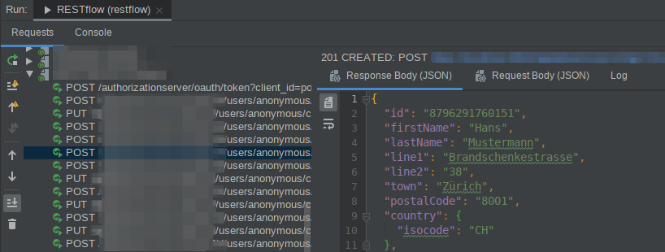

Project status
==============

For now, this is just a quick fork from
[netconomy/restflow](https://github.com/netconomy/restflow)
to fix some major breakages, mostly in the IDEA plugin.

Thanks a lot to NETCONOMY for releasing the source code and thus allowing this
tool to live on. :)


RESTflow
========

RESTflow is a Groovy DSL that allows to easily communicate with REST
endpoints (any HTTP endpoints, actually). A small example of what this looks
like:

```groovy
apply 'local' // apply profile for local testing
def myCartId = '...' // probably multiple REST calls
POST("/carts/$myCartId") {
  json [ product: [code: '12345'], quantity: 1]
}
assert response.statusCode == 200
assert response.json.quantityAdded == 1
// you can also replace 'json' with 'xml', looks more or less the same
```

It also includes an IDEA plugin that makes IDEA fully aware of the DSL. You
can run RESTflow scripts from within the IDE and use it as an interactive
console. The log is presented in an interface similar to the unit test run
window:



Other front-ends included are a simple command line runner and a console
based on the standard Groovy console.

Because it's basically just Groovy, it seamlessly integrates with Spock for
automated integration tests:
 
```groovy
when: "Post this and that to my endpoint"
POST('this/and/that') {
    xml.'my-root' {
        'my-element'('my-attr': 42, 'foo')
    }
}

then: "The return code is OK"
response.statusCode == 200

```

For full documentation see the API docs of the DSL classes:

* [RestFlow](core/src/main/groovy/net/netconomy/tools/restflow/dsl/RestFlow.groovy)
* [RequestConfig](core/src/main/groovy/net/netconomy/tools/restflow/dsl/RequestConfig.groovy)
* [Response](core/src/main/groovy/net/netconomy/tools/restflow/dsl/Response.groovy)
